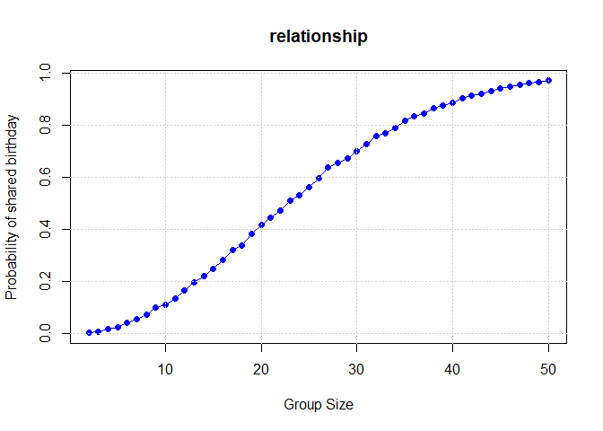
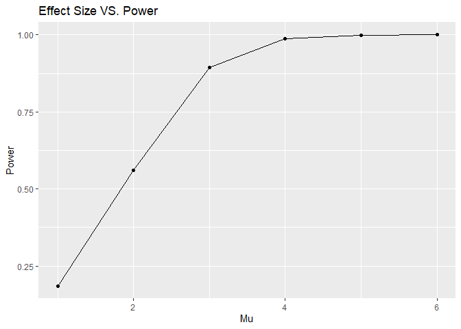
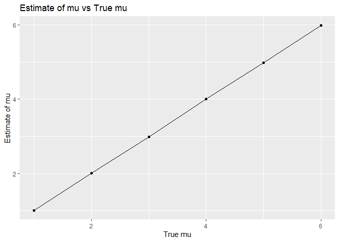
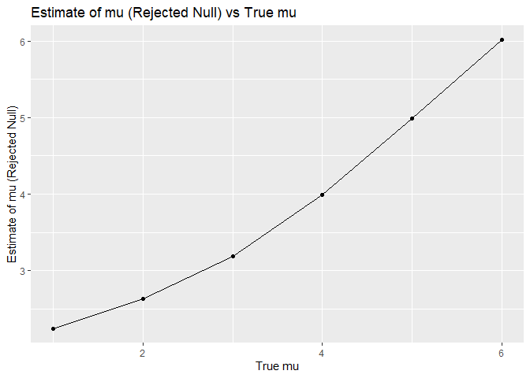
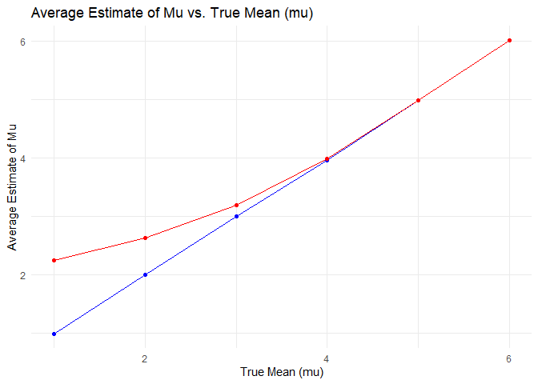
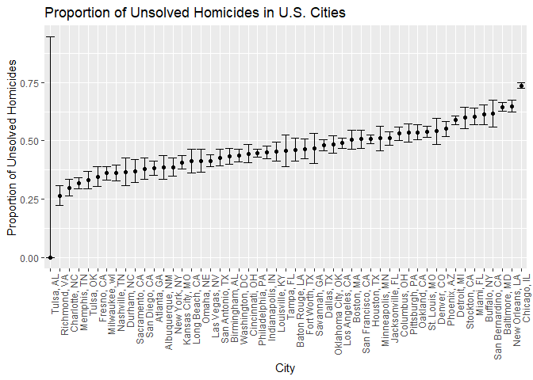

p8105_hw5_sz3319
================
Shiyu Zhang
2024-11-15

``` r
library(tidyverse)
library(knitr)
library(rvest)
library(broom)
library(dplyr)
library(purrr)
library(ggplot2)
```

## Problem 1

### 1.1

``` r
set.seed(666)

shared_birth = function(n) {
  birth = sample(1:365, n, replace = TRUE)
  return(length(birth) != length(unique(birth)))
}
```

### 1.2

``` r
n_simu = 10000
n_group = 2:50
p_share = numeric(length(n_group))
```

``` r
for (n in n_group) {
  shared_count = 0
  for (x in 1:n_simu) {
    if (shared_birth(n)) {
      shared_count = shared_count + 1
    }
  }
  probability = shared_count / n_simu
  p_share[n - 1] = probability
}
```

### 1.3

``` r
plot(n_group, p_share, type = "o", 
     main = "relationship", 
     xlab = "Group Size", 
     ylab = "Probability of shared birthday", 
     col = "blue", 
     pch = 16)
grid()
```

<!-- -->

## Problem 2

### 2.1

``` r
n = 30
sigma = 5  
alpha = 0.05
mu_values = c(1, 2, 3, 4, 5, 6)  
n_simulations = 5000  
```

``` r
results_p2 = data.frame(mu = numeric(), power = numeric(), mu_hat = numeric(), p_value = numeric())
```

``` r
set.seed(123)

for (mu in mu_values) {
  power_count = 0 
  mu_hat_vals = numeric(n_simulations) 
  p_vals = numeric(n_simulations) 
  for (i in 1:n_simulations) {
    data = rnorm(n, mean = mu, sd = sigma)  
    t_test_result = tidy(t.test(data, mu = 0))
    p_vals[i] = t_test_result$p.value
    mu_hat_vals[i] = t_test_result$estimate
    if (p_vals[i] < 0.05) {
      power_count = power_count + 1
    }
  }
  power = power_count / n_simulations
  results_p2 = rbind(results_p2, data.frame(mu = mu, power = power, mu_hat = mean(mu_hat_vals), p_value = mean(p_vals)))
}

kable(results_p2)
```

|  mu |  power |   mu_hat |   p_value |
|----:|-------:|---------:|----------:|
|   1 | 0.1852 | 1.009001 | 0.3461114 |
|   2 | 0.5614 | 2.009651 | 0.1172932 |
|   3 | 0.8944 | 2.991688 | 0.0223620 |
|   4 | 0.9886 | 4.009762 | 0.0028160 |
|   5 | 0.9990 | 4.979137 | 0.0003886 |
|   6 | 1.0000 | 5.984395 | 0.0000257 |

### 2.2 Make plots

``` r
ggplot(results_p2, aes(x = mu, y = power)) +
  geom_line() +
  geom_point() +
  labs(title = "Effect Size VS. Power",
       x = "Mu",
       y = "Power")
```

<!-- -->

This plot shows a positive correlation between effect size and power,
demonstrating that as the effect size increases, the statistical power
of the test also increases. Larger effect sizes make it much easier for
the test to detect a true effect.

### 2.3

- Estimate of mu vs True mu

``` r
ggplot(results_p2, aes(x = mu, y = mu_hat)) +
  geom_line() +
  geom_point() +
  labs(title = "Estimate of mu vs True mu",
       x = "True mu",
       y = "Estimate of mu")
```

<!-- -->

- Estimate of mu (Rejected Null) vs True mu

``` r
results_n = data.frame(mu = numeric(), mu_hat = numeric(), p_value = numeric())

for (mu in mu_values) {
  simulations = replicate(n_simulations, {
    sample_data = rnorm(n, mean = mu, sd = sigma)
    test_result = t.test(sample_data, mu = 0)
    tidy_result = broom::tidy(test_result)
    data.frame(mu = mu, estimate = tidy_result$estimate, p_value = tidy_result$p.value)
  }, simplify = FALSE) 
  results_n = bind_rows(results_n, do.call(rbind, simulations))
}
```

``` r
mu_hat_results = results_n  |> 
  group_by(mu) |> 
  summarise(
    avg_estimate_all = mean(estimate), 
    avg_estimate_rejected = mean(estimate[p_value < alpha], na.rm = TRUE) 
  )
```

``` r
ggplot(mu_hat_results, aes(x = mu, y = avg_estimate_rejected)) +
  geom_point() + 
  geom_line() +
  labs(title = "Estimate of mu (Rejected Null) vs True mu",
       x = "True mu",
       y = "Estimate of mu (Rejected Null)")
```

<!-- -->

- Combined plot

``` r
ggplot(mu_hat_results, aes(x = mu)) +
geom_point(aes(y = avg_estimate_all), color = "blue") + # All samples
geom_line(aes(y = avg_estimate_all), color = "blue") +
geom_point(aes(y = avg_estimate_rejected), color = "red") + # Only rejected samples
geom_line(aes(y = avg_estimate_rejected), color = "red") +
labs(
title = "Average Estimate of Mu vs. True Mean (mu)",
x = "True Mean (mu)",
y = "Average Estimate of Mu"
) +
scale_color_manual(name = "Sample Type", values = c("All Samples" = "blue", "Null Rejected" = "red")) +
theme_minimal()
```

<!-- -->

This plot shows that when mu increases, both lines show an upward trend,
with rejected null line consistently giving higher estimates, suggesting
that rejecting the null hypothesis leads to estimates closer to the true
value of mu.

## Problem 3

``` r
homicide_data = read_csv("data/homicide-data.csv", na = c("NA", "", ".")) |> 
  janitor::clean_names() |> 
  rename_with(~ gsub("^x", "", .))
```

The variables are:

- Victim Characteristics: victim_last, victim_first, victim_race,
  victim_age, victim_sex.
- Case Information: uid, report data, disposition.
- Location: city, state, latitude, longitude.

### 3.1 Clean data

``` r
homicide_clean = homicide_data |>
  mutate(city_state = paste(city, state, sep = ", ")) |>
  group_by(city_state) |>
  summarise(
    total_homicides = n(),
    unresolved_homicides = sum(disposition %in% c("Closed without arrest", "Open/No arrest"))
  )
```

### 3.2 Baldimore

``` r
baltimore_data <- homicide_clean |>
  filter(city_state == "Baltimore, MD") |>
  select(city_state, unresolved_homicides, total_homicides)

unresolvedhomi = pull(baltimore_data, unresolved_homicides)
totalhomi = pull(baltimore_data, total_homicides)

baltimore_prop_test = prop.test(unresolvedhomi, totalhomi)

tidy_baltimore_result <- tidy(baltimore_prop_test)

# stimate, p.value, conf.low 和 conf.high
result_summary <- tidy_baltimore_result |>
  select(estimate, p.value, conf.low, conf.high) |>
  mutate(CI = paste0("(", round(conf.low, 4), ", ", round(conf.high, 4), ")")) |>
  select(estimate, p.value, CI)

result_summary |>
  knitr::kable()  
```

|  estimate | p.value | CI               |
|----------:|--------:|:-----------------|
| 0.6455607 |       0 | (0.6276, 0.6632) |

- **64.56%** of homicides in Baltimore are unsolved, which is a high
  percentage.
- The p-value indicates that this result is statistically significant,
  so we can be confident that the proportion of unsolved homicides is
  not zero.
- The 95% confidence interval tells us that the true proportion of
  unsolved homicides likely falls between **62.76%** and **66.32%**.

### 3.3 Cities

``` r
#prop.test()
city_proportions = homicide_clean|>
  mutate(
    prop_test = purrr::map2(total_homicides, unresolved_homicides, ~prop.test(.y, .x)),
    tidy_result = purrr::map(prop_test, broom::tidy)
  ) |>
  unnest(tidy_result) |> 
   select(city_state, estimate, p.value, conf.low, conf.high)

head(city_proportions)
```

    ## # A tibble: 6 × 5
    ##   city_state      estimate  p.value conf.low conf.high
    ##   <chr>              <dbl>    <dbl>    <dbl>     <dbl>
    ## 1 Albuquerque, NM    0.386 1.23e- 5    0.337     0.438
    ## 2 Atlanta, GA        0.383 4.32e-13    0.353     0.415
    ## 3 Baltimore, MD      0.646 6.46e-54    0.628     0.663
    ## 4 Baton Rouge, LA    0.462 1.32e- 1    0.414     0.511
    ## 5 Birmingham, AL     0.434 2.05e- 4    0.399     0.469
    ## 6 Boston, MA         0.505 8.40e- 1    0.465     0.545

``` r
# set in order
city_proportions_sorted = city_proportions |>
  arrange(estimate)  

ggplot(city_proportions_sorted, aes(x = reorder(city_state, estimate), y = estimate, ymin = conf.low, ymax = conf.high)) +
  geom_point() +
  geom_errorbar() +
  labs(
    title = "Proportion of Unsolved Homicides in U.S. Cities",
    x = "City",
    y = "Proportion of Unsolved Homicides"
  ) +
  theme(axis.text.x = element_text(angle = 90, hjust = 1)) 
```

<!-- -->

- This plot shows that some cities, such as Chicago and New Orleans,
  have higher rates of unsolved homicide cases.
- The CI shows that most cities show relatively tight intervals, while a
  few show greater uncertainty.
